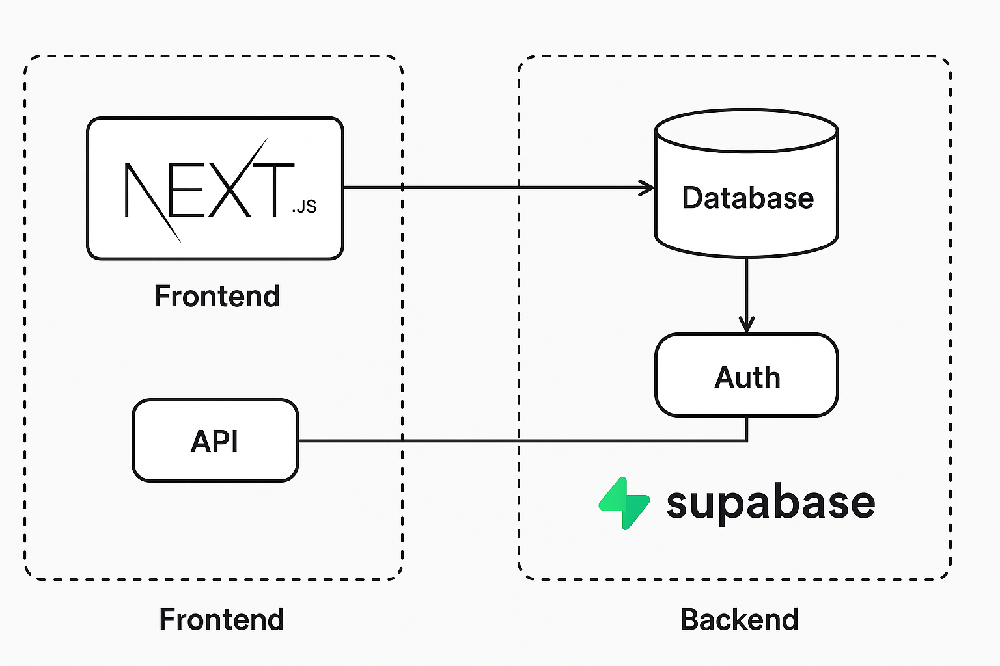
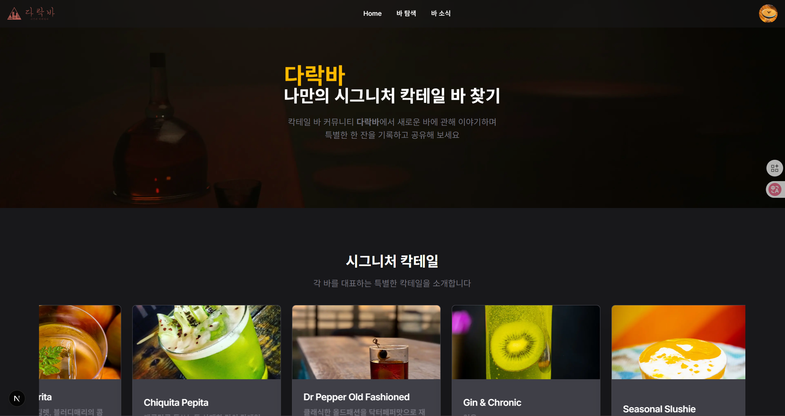
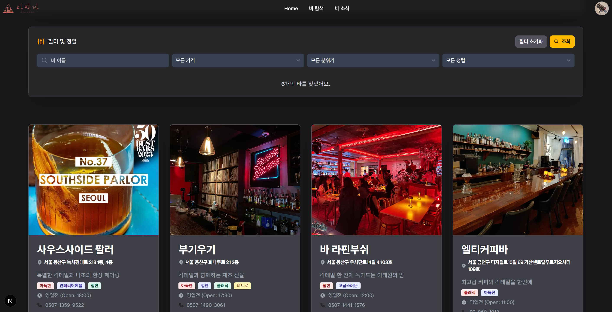
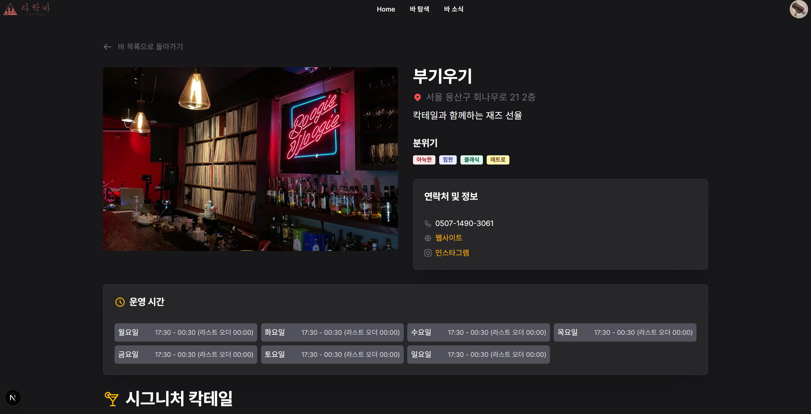
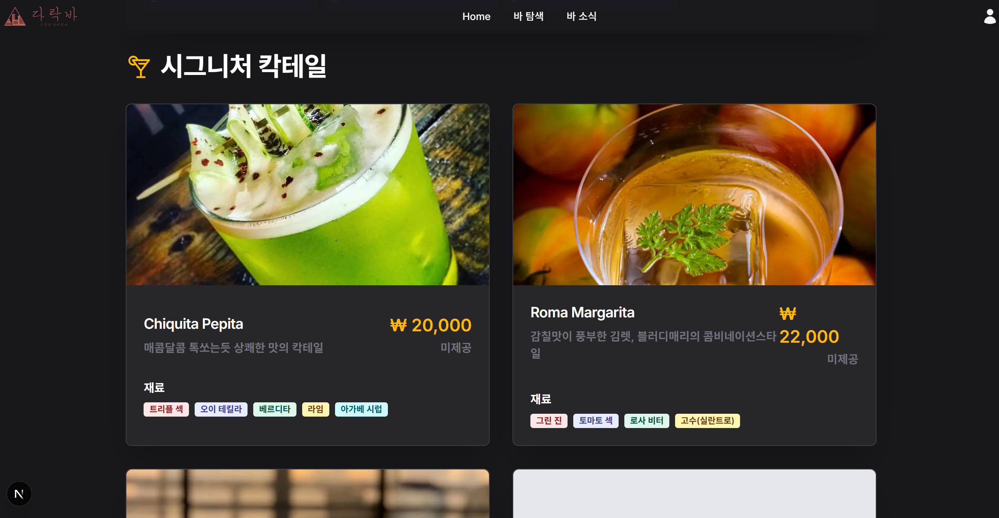
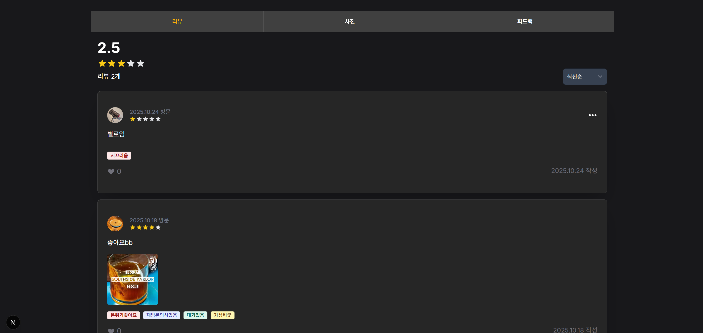

## 프로젝트 아키텍처

  

## 🎉 프로젝트 개요

평소 칵테일을 좋아해 다양한 바를 찾아다니면서, 기존 플랫폼에서는 각 바의 메뉴 정보를 충분히 제공받기 어렵다는 점을 느꼈습니다. 이러한 불편함을 해결하고자 다락바라는 프로젝트를 기획했습니다.

칵테일과 술을 즐기는 사람들이 자신이 좋아하는 바, 그리고 그곳에서만 경험할 수 있는 특별한 분위기와 순간을 서로 공유할 수 있는 공간을 만드는 것을 목표로 진행 중입니다.

## 👊🏻 프로젝트 목표

1. 전국 단위로 바/펍/와인바를 **탐색**하고, **신뢰 가능한 메뉴판과 시그니처 칵테일**을 확인 및 기여할 수 있는 서비스.
2. 현재 위치 기반 탐색, 지역·테마별 탐색, 메뉴 중심(칵테일/위스키/와인) 검색의 기능 수행
3. 업주에 의한 피드(신메뉴, 이벤트 등)를 조회, 등록, 수정, 삭제할 수 있는 기능 수행
4. 개별 바의 시그니처 칵테일마다 테이스팅 노트를 조회, 등록, 수정, 삭제할 수 있는 기능 수행

## 🛠️ 기술 스택

**프론트엔드**

- `Next.js`
- `TypeScript`
- `Zustand`
- `TailwindCSS`

**백엔드**

- `Supabase`(PostgreSQL)

**주요 라이브러리**

- `Flowbite` - 디자인 컴포넌트
- `Tanstack Query` - 네트워크 요청 및 캐싱 최적화
- `Zod` - 런타임 데이터 검증
- `React-hook-form` - 폼 관리 최적화
- `query-key-factory` - 쿼리 키 전역 관리

## 🚧 현재까지의 구현 내용

**1. 렌딩 페이지**

  

- tailwindCSS 커스텀 유틸리티 기반 Infinity Scroll 구현

**2. 바 조회**

  

- **Supabase + Cursor MCP** 기반 DB 설계 및 **타입 자동 생성**을 적용하여 개발 속도 향상 및 데이터 무결성 확보

**3. 바 상세 정보**

  
  

- 바의 영업 정보와 시그니처 칵테일 정보 제공
- **React Query** 와 **query key** 전역관리로 여러 API 요청 캐싱 최적화, 데이터 응답 속도 향상 및 불필요한 네트워크 호출 절감

**4. 리뷰**

  

- 리뷰 CRUD 기능 구현
- 리뷰 좋아요 기능에 **Optimistic Update**를 적용해 즉각적인 피드백으로 사용자 경험을 향상

## 😀 컨벤션

**디렉토리 명**

- 기본적으로 `kebab-case` 사용

**타입/스키마/상수/스토어**

- `.types.ts`
- `.schemes.ts`
- `.const.ts`
- .`store.ts`
- `kebab-case` 사용

**목업 데이터**

- `.mocks.ts`
- `camelCase` 사용

**함수**

- `camelCase` 사용

**쿼리 키 팩토리**

- `camelCase` 사용
- `<기능>Keys.ts`
